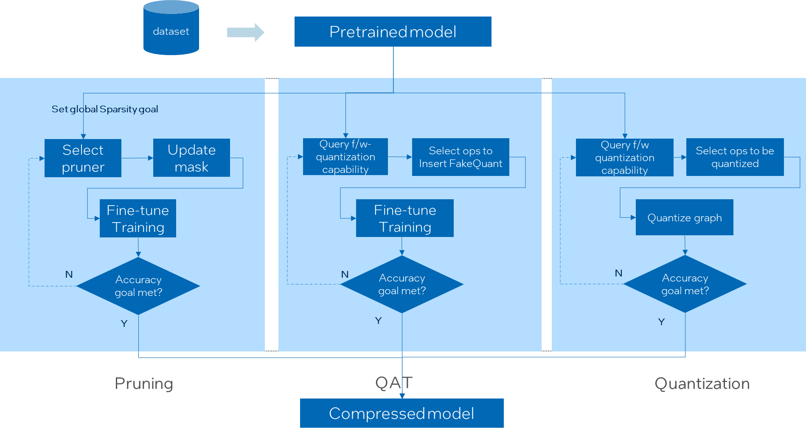

Quantization
===============

## Quantization introduction

Quantization is a very popular deep learning model optimization technique invented for improving the speed of inference. It minimizes the number of bits required by converting a set of real-valued numbers into the lower bit data representation, such as int8 and int4, mainly on inference phase with minimal to no loss in accuracy. This way reduces the memory requirement, cache miss rate, and computational cost of using neural networks and finally achieve the goal of higher inference performance. On Intel 3rd generation Xeon Scalable processor, user could expect up to 4x theoretical performance speedup. On Nvidia GPU, it could also bring significant inference performance speedup.

### Quantization fundamentals

`Affine quantization` and `Scale quantization` are two common range mapping techniques used in tensor conversion between different data types.

**Affine Quantization**

This is so-called `asymmetric quantization`, in which we map the min/max range in the float tensor to the integer range. Here int8 range is [-128, 127], uint8 range is [0, 255]. 

The math equation is like:

```
X_int8 = round(Scale * X_fp32 + ZeroPoint)     # round to nearest integer

here:

Scale = 255 / (|X_f_max - X_f_min|)      # if UINT8 is specified

or

Scale = 127 / (|X_f_max - X_f_min|)      # if INT8 is specified
,

ZeroPoint = 0                            # if INT8 is specified

or

ZeroPoint = 128                          # if UINT8 is specified

```

**Scale Quantization**

This is so-called `Symmetric quantization`, in which we use the maximum absolute value in the float tensor as float range and map to the corresponding integer range. 

The math equation is like:

```
X_int8 = Scale * X_fp32

here:

Scale = 127 / max(abs(X_f_max), abs(X_f_min)) # if INT8 is specified

or

Scale = 255 / max(abs(X_f_max), abs(X_f_min)) # if UINT8 is specified

```

*NOTE*

Sometime the reduce_range feature, that's using 7 bit width (1 sign bit + 6 data bits) to present int8 range, may be needed on some early Xeon platforms, it's because those platforms may have overflow issue due to fp16 intermediate calculation result when executing int8 dot product operation. After AVX512_VNNI instruction is introduced, this issue gets solved by supporting fp32 intermediate data.

### Quantization approaches

Quantization has three different approaches: 1) post training dynamic quantization 2) post training static  quantization 3) quantization aware training. The first two approaches belong to optimization on inference. The last belongs to optimization during training.

#### Post training dynamic quantization

The weights of the neural network get quantized into int8 format from float32 format offline. The activations of the neural network is quantized as well with the min/max range collected during inference runtime.

This approach is widely used in dynamic length neural networks, like NLP model.

#### Post training static quantization

Comparing with `post training dynamic quantization`, the min/max range in weights and activations are collected offline on a so-called `calibration` dataset. This dataset should be able to present the data distribution of those unseen inference dataset. The `calibration` process runs on the original fp32 model and dumps out all the tensor distributions for `Scale` and `ZeroPoint` calculations. Usually preparing 100 samples are enough for calibration.

This approach is major quantization approach people should try because it could provide the better performance comparing with `post training dynamic quantization`.

#### Quantization aware training

Quantization aware training emulates inference-time quantization by inserting `fake quant` ops before those quantizable ops, and requests fine-tune training on this modified model. This approach usually provides better model accuracy than `post training quantization`.

## Accuracy aware tuning

Accuracy aware tuning is one of unique features provided by Intel(R) Neural Compressor, comparing with other 3rd party model compression tools. This feature can be used to solve accuracy loss painpoints brought by applying low precision quantization and other lossy optimization methods. 

This tuning algorithm creates a tuning space by querying framework quantization capability and model structure, selects the ops to be quantized by some strategy, generates quantized graph, and evalutes the accuracy of this quantized graph. The optimal model will be yielded if the pre-defined accuracy goal is met.

### working flow

Currently `accuracy aware tuning` supports `post training quantization`, `quantization aware training`, and `pruning`. Other during-training optimization tuning is under development.

User could refer to below chart to understand the whole tuning flow.



## Supported feature matrix

## Quantization API summary

## Examples
